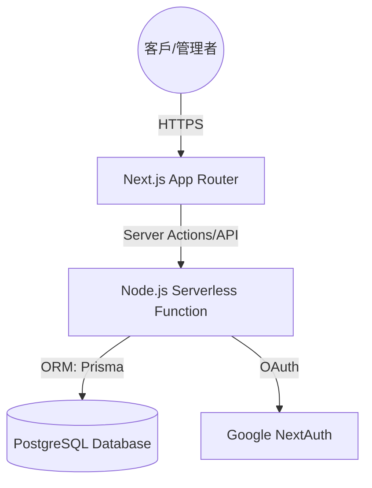

# 新泰汽車傳動軸 - 系統分析與設計文件 (SAD)

## 📋 目錄
- [1. 系統分析 (System Analysis)](#1-系統分析-system-analysis)
    - [1.1 需求分析 (Requirement Analysis)](#11-需求分析-requirement-analysis)
    - [1.2 目標使用者 (Target Users)](#12-目標使用者-target-users)
- [2. 系統設計 (System Design)](#2-系統設計-system-design)
    - [2.1 系統架構圖 (Architecture)](#21-系統架構圖-architecture)
    - [2.2 資料庫設計 (Database Design)](#22-資料庫設計-database-design)
    - [2.3 關鍵技術實作 (Key Implementation)](#23-關鍵技術實作-key-implementation)
- [3. 系統規格 (Technical Specifications)](#3-系統規格-technical-specifications)
    - [3.1 開發環境 (Environment)](#31-開發環境-environment)
    - [3.2 依賴與版本 (Dependencies)](#32-依賴與版本-dependencies)
- [4. 安全設計 (Security)](#4-安全設計-security)

## 1. 系統分析 (System Analysis)

### 1.1 需求分析 (Requirement Analysis)
本系統旨在解決傳動軸維修店家的三大痛點：
1. **人力瑣碎**：傳統電話約診耗時且難以管理。
2. **資訊不對稱**：客戶難以快速確認保固狀態。
3. **品牌維護**：品牌資訊若有變動（如電話、地址）需多處修改。

### 1.2 目標使用者 (Target Users)
- **一般客戶**：尋求專業維修、線上預約、保固查詢。
- **管理者 (老闆)**：管理預約訂單、調整營運參數、維護客戶記錄。

## 2. 系統設計 (System Design)

### 2.1 系統架構圖 (Architecture)

### 2.2 資料庫設計 (Database Design)

#### 核心實體關聯 (ER Example)
- **User (1) <-> Appointment (N)**: 紀錄預約發起人。
- **Customer (1) <-> Vehicle (N)**: 一位客戶可擁有多台車輛記錄。
- **Service (1) <-> Appointment (N)**: 每筆預約歸屬於某個維修項目。
- **Holiday**: 記錄國定假日與補班日，供預約系統邏輯判定。

### 2.3 關鍵技術實作 (Key Implementation)

#### 2.3.1 動態設定 (Dynamic Settings)
採用 **Single-Row Table** 模式。系統啟動時若偵測無設定，自動根據 `Prisma` 模型預設值建立 `id: "default"` 的記錄。前端透過 `useSettings` 自定義 Hook 搭配客戶端快取，確保效能與同步。

#### 2.3.2 預約邏輯 (Booking Flow)
系統採用 `date-fns` 進行伺服器與客戶端的時間同步處理。預約介面改為 **月曆格式 (Monthly View)**，支援跨月份瀏覽。點擊日期後會彈出 **時段選擇視窗 (Slot Modal)**，根據 `Settings` 表中的 `slotDuration` 動態切換顯示與遮蔽，並自動過濾已預約與過期時段。

#### 2.3.3 保固驗證 (Warranty Verification)
為保護隱私，保固查詢採用 `CarPlate` + `PhoneNumber` 的雙重驗證。查詢結果僅回傳該車輛的最新有效保固記錄。

#### 2.3.4 假日管理與覆蓋 (Holiday Management & Override)
串接政府行政機關日曆 API 獲取基礎資料，並結合管理者 **手動覆蓋 (Manual Override)** 機制。系統優先判斷資料庫中是否存在特定日期的規則，若無則參考預設週休邏輯。這使得「假日加班營業」或「平日排定店休」成為可能。

#### 2.3.5 狀態管理優化 (Status Tracking)
導入正式的 `CANCELLED` 狀態。當管理者取消預約時，系統會釋放資料庫時段索引，確保預約看板的「總計」與「已完成」統計數據精確。

## 3. 系統規格 (Technical Specifications)

### 3.1 開發環境 (Environment)
- **Node.js**: v20+ 
- **Package Manager**: npm
- **Language**: TypeScript 5.x

### 3.2 依賴與版本 (Dependencies)
- **Frontend**: Next.js 15.x, React 19.x, Tailwind CSS 4.x
- **ORM**: Prisma 5.x
- **Auth**: NextAuth.js 5.0-beta
- **UI Components**: Radix UI, Lucide React

## 4. 安全設計 (Security)
- **RLS (Potential)**: 未來可延伸至 Supabase RLS。
- **Admin Authorization**: 僅具備 `ADMIN` 角色的 User 帳號可進入 `/admin` 路由。
- **Input Validation**: 使用驗證函式過濾車牌格式與電話號碼。

---
最後更新時間：2026-01-09
