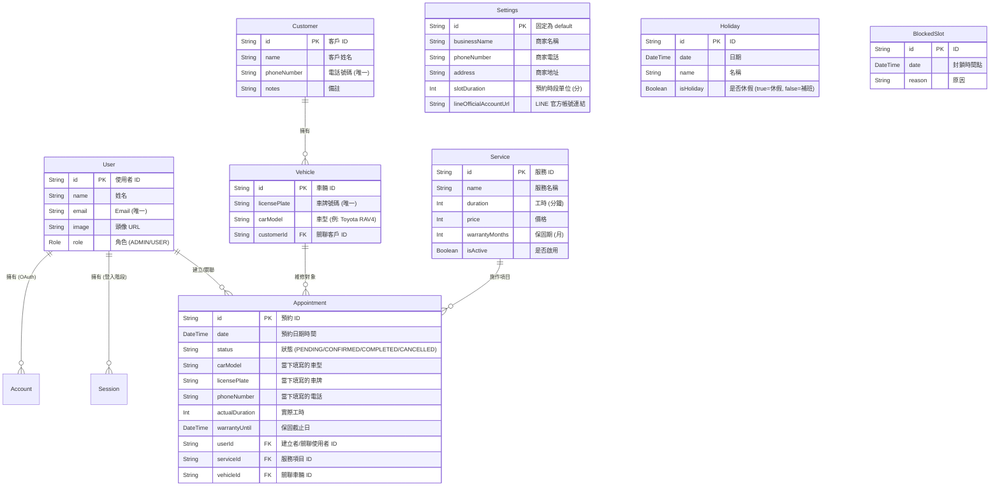

# 資料庫架構文件 (Database Schema)

本文件描述 **Shintai Driveshaft (新泰汽車傳動軸)** 預約系統的資料庫實體關聯模型 (ER Model)。

## 實體關聯圖 (ER Diagram)

## 資料表欄位詳細說明

### 1. User (使用者)
系統的使用者，包含管理員和一般客戶（若有開放註冊）。
*   `id`: 唯一識別碼 (CUID)
*   `name`: 使用者顯示名稱
*   `email`: 電子郵件 (用於登入)
*   `role`: 權限角色，區分為 `ADMIN` (管理員) 與 `USER` (一般用戶)

### 2. Customer (客戶資料)
由管理員建立或系統自動歸檔的客戶資料，主要依據電話號碼識別。
*   `phoneNumber`: 客戶電話，作為唯一識別鍵。
*   `vehicles`: 該客戶名下的車輛列表。

### 3. Vehicle (車輛資料)
其輛資料，綁定於特定客戶。
*   `licensePlate`: 車牌號碼，標準化後儲存 (去除符號，轉大寫)。
*   `carModel`: 車型描述。

### 4. Appointment (預約)
核心預約資料，記錄了誰、什麼時候、做什麼服務。
*   `date`: 預約的具體時間點 (例如 2023-10-27 09:00:00)。
*   `status`: 預約狀態。
    *   `PENDING`: 等待確認
    *   `CONFIRMED`: 已確認
    *   `COMPLETED`: 已完工 (會觸發保固計算)
    *   `CANCELLED`: 已取消
*   `warrantyUntil`: 保固截止日期。當狀態變為 `COMPLETED` 時，系統會根據 Service 的保固設定自動計算並填入此欄位。

### 5. Service (服務項目)
提供的維修服務項目定義。
*   `duration`: 預設工時，用於排程計算。
*   `warrantyMonths`: 保固月數，用於計算 `warrantyUntil`。

### 6. Settings (全域設定)
系統的全域設定參數。
*   `lineOfficialAccountUrl`: LINE 官方帳號的加入連結，用於前端顯示按鈕。
